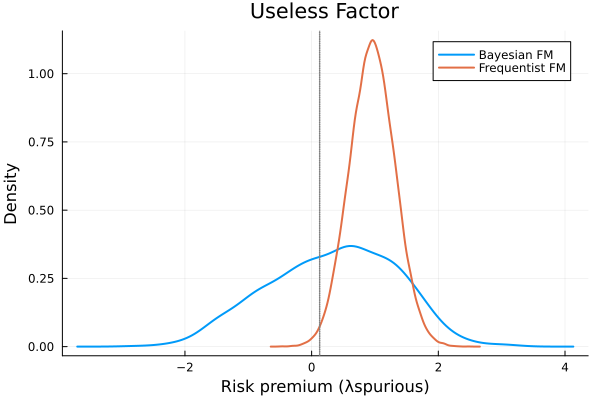

# Examples (from R Documentation)

## Set Up

### Load Required Packages

```julia
using BayesianFactorZoo
using RCall # to get the orignal example data
using DataFrames
using StatsPlots # Plotting
using Distributions
using Statistics
using StatsBase
```

### Load Data From the R Package

```julia
R"""
library(BayesianFactorZoo)
data("BFactor_zoo_example")

HML = BFactor_zoo_example$"HML"
lambda_ols = BFactor_zoo_example$"lambda_ols"
R2_ols_true = BFactor_zoo_example$"R2.ols.true"
sim_f = BFactor_zoo_example$"sim_f"
sim_R = BFactor_zoo_example$"sim_R"
uf = BFactor_zoo_example$"uf"
W_ols = BFactor_zoo_example$"W_ols"
""";

# Extract all components

# Get the data from R
@rget HML lambda_ols R2_ols_true sim_f sim_R uf W_ols;
```

## Example Bayesian Fama-MacBeth

### Case 1: Strong factor

#### Frequentist Fama-MacBeth

```julia
results_fm = TwoPassRegression(sim_f, sim_R)
```
Console Output:
```julia
Two-Pass Regression Results:
--------------------------------
Model Information:
  Number of factors: 1
  Number of assets: 25
  Time periods: 1000

OLS Risk Premia Estimates:
  λ_0: 0.1672 (SE: 0.0293, t: 5.71)
  λ_1: 0.1666 (SE: 0.0346, t: 4.82)

GLS Risk Premia Estimates:
  λ_0: 0.1238 (SE: 0.0267, t: 4.64)
  λ_1: 0.1693 (SE: 0.0322, t: 5.25)

Model Fit:
  Adjusted R² (OLS): 0.5804
  Adjusted R² (GLS): 0.8377

```

#### Bayesian Fama-MacBeth

```julia
results_bfm = BayesianFM(sim_f, sim_R, 2000)
```
Console Ouput:
```juia
Bayesian Fama-MacBeth Results:
--------------------------------
Model Information:
  Number of factors: 1
  Number of assets: 25
  Time periods: 1000
  MCMC iterations: 2000

Risk Premia Estimates (OLS):
  λ_0: 0.1666 (±0.0294)
  λ_1: 0.1657 (±0.0353)

Model Fit:
  Mean R² (OLS): 0.5298
  Mean R² (GLS): 0.8108
```

### Extract results for plotting
```julia
k = 2;  # lambda of the strong factor
m1 = results_fm.lambda[k];
sd1 = sqrt(results_fm.cov_lambda[k,k]);
```
#### Get posterior draws
```julia
bfm = results_bfm.lambda_ols_path[1001:2000,k];
```

#### Generate frequentist draws
```julia
rng = MersenneTwister(123);  # for reproducibility
fm = rand(rng, Normal(m1, sd1), 20000);
```

#### Create plotting DataFrame
```julia
df = DataFrame(
    Value = vcat(fm, bfm),
    Method = vcat(fill("Frequentist FM", 20000), fill("Bayesian FM", 1000))
)
```
Console Output:
```julia
21000×2 DataFrame
   Row │ Value     Method
       │ Float64   String
───────┼──────────────────────────
     1 │ 0.207803  Frequentist FM
     2 │ 0.237487  Frequentist FM
     3 │ 0.206156  Frequentist FM
     4 │ 0.182515  Frequentist FM
     5 │ 0.152894  Frequentist FM
     6 │ 0.14362   Frequentist FM
   ⋮   │    ⋮            ⋮
 20996 │ 0.19532   Bayesian FM
 20997 │ 0.130483  Bayesian FM
 20998 │ 0.174461  Bayesian FM
 20999 │ 0.226412  Bayesian FM
 21000 │ 0.123783  Bayesian FM
                20989 rows omitted
```
#### Create density plot
```julia
p1 = @df df density(:Value, group=:Method, 
    linewidth=2,
    xlabel="Risk premium (λstrong)",
    ylabel="Density",
    title="Strong Factor"
)
vline!([lambda_ols[2]], linestyle=:dot, linewidth=1.5, color=:grey, label="")
```


### Case 2: Useless factor
#### Repeat the process with useless factor (uf)
```julia
results_fm_uf = TwoPassRegression(uf, sim_R)
```
Console Output:
```julia
Two-Pass Regression Results:
--------------------------------
Model Information:
  Number of factors: 1
  Number of assets: 25
  Time periods: 1000

OLS Risk Premia Estimates:
  λ_0: 0.1599 (SE: 0.0401, t: 3.99)
  λ_1: 0.9540 (SE: 0.3578, t: 2.67)

GLS Risk Premia Estimates:
  λ_0: 0.1057 (SE: 0.0362, t: 2.93)
  λ_1: -0.4335 (SE: 0.2760, t: -1.57)

Model Fit:
  Adjusted R² (OLS): -0.0075
  Adjusted R² (GLS): -0.0125

```

```julia
results_bfm_uf = BayesianFM(uf, sim_R, 2000)
```
Console Output:
```julia
Bayesian Fama-MacBeth Results:
--------------------------------
Model Information:
  Number of factors: 1
  Number of assets: 25
  Time periods: 1000
  MCMC iterations: 2000

Risk Premia Estimates (OLS):
  λ_0: 0.1510 (±0.0417)
  λ_1: 0.3079 (±0.9905)

Model Fit:
  Mean R² (OLS): 0.0842
  Mean R² (GLS): 0.0013
```

```julia
m1_uf = results_fm_uf.lambda[k]
sd1_uf = sqrt(results_fm_uf.cov_lambda[k,k])
bfm_uf = results_bfm_uf.lambda_ols_path[1001:2000,k]
fm_uf = rand(rng, Normal(m1_uf, sd1_uf), 20000)
df_uf = DataFrame(
    Value = vcat(fm_uf, bfm_uf),
    Method = vcat(fill("Frequentist FM", 20000), fill("Bayesian FM", 1000))
)
```
Console Output:
```julia
21000×2 DataFrame
   Row │ Value      Method
       │ Float64    String
───────┼───────────────────────────
     1 │  0.961224  Frequentist FM
     2 │  1.10149   Frequentist FM
     3 │  1.43786   Frequentist FM
     4 │  1.35079   Frequentist FM
     5 │  1.56759   Frequentist FM
     6 │  1.21512   Frequentist FM
   ⋮   │     ⋮            ⋮
 20996 │ -1.26963   Bayesian FM
 20997 │  0.669039  Bayesian FM
 20998 │ -0.802147  Bayesian FM
 20999 │  2.36535   Bayesian FM
 21000 │ -0.601039  Bayesian FM
                 20989 rows omitted
```

```julia
p2 = @df df_uf density(:Value, group=:Method, 
    linewidth=2,
    xlabel="Risk premium (λspurious)",
    ylabel="Density",
    title="Useless Factor"
)

vline!([lambda_ols[2]], linestyle=:dot, linewidth=1.5, color=:grey, label="")
```


#### Display plots side by side
```julia
plot(p1, p2, layout=(1,2), size=(1200,400),bottom_margin=5Plots.mm)
```


## Example Bayesian estimates of risk prices and R2 (Bayesian SDF)
 - Cross-section: Fama-French 25 size and value portfolios  
 - True pricing factor in simulations: HML  
 - Pseudo-true cross-sectional R-squared: 0.43  
 - Pseudo-true (monthly) risk price: 0.127  

### Case 1: Strong factor
#### GMM estimation
```julia
sim_result = SDF_gmm(sim_R, sim_f, W_ols)
```
Console Output:
```julia
SDF GMM Results:
--------------------------------
Model Information:
  Number of factors: 1
  Number of assets: 25
  Time periods: 1000

Risk Price Estimates:
  λ_0: 0.1672
  λ_1: 0.1666

Model Fit:
  Adjusted R²: 0.5804
```

#### Bayesian estimation
```julia
two_step = BayesianSDF(sim_f, sim_R, 2000; psi0=5.0, d=0.5)
```

Console Output:
```julia
Bayesian SDF Results:
--------------------------------
Model Information:
  Number of factors: 1
  Number of assets: 25
  Time periods: 1000
  MCMC iterations: 2000
  Prior type: Flat
  Estimation type: OLS

Risk Price Estimates:
  λ_0: 0.1644 (±0.0291)
  λ_1: 0.1634 (±0.0353)

Model Fit:
  Mean R²: 0.5287 (±0.1228)
```

#### Extract results for plotting
```julia
k = 2  # lambda of the strong factor
m1 = sim_result.lambda_gmm[k]
sd1 = sqrt(sim_result.Avar_hat[k,k])

# Get posterior draws
bfm = two_step.lambda_path[1001:2000, k]

# Generate GMM draws
rng = MersenneTwister(123)  # for reproducibility
fm = rand(rng, Normal(m1, sd1), 5000)

# Create plotting DataFrame for strong factor
df_strong = DataFrame(
    Value = vcat(fm, bfm),
    Method = vcat(fill("GMM-OLS", 5000), fill("BSDF-OLS", 1000))
)
```

Console Output:
```julia
6000×2 DataFrame
  Row │ Value     Method   
      │ Float64   String
──────┼────────────────────
    1 │ 0.208319  GMM-OLS
    2 │ 0.238374  GMM-OLS
    3 │ 0.20665   GMM-OLS
    4 │ 0.182714  GMM-OLS
    5 │ 0.152722  GMM-OLS
    6 │ 0.143332  GMM-OLS
  ⋮   │    ⋮         ⋮
 5996 │ 0.192677  BSDF-OLS
 5997 │ 0.118785  BSDF-OLS
 5998 │ 0.173055  BSDF-OLS
 5999 │ 0.218479  BSDF-OLS
 6000 │ 0.125678  BSDF-OLS
          5989 rows omitted
```

#### Create density plot for strong factor
```julia
p1 = @df df_strong density(:Value, group=:Method, 
    linewidth=2,
    xlabel="Risk price (λstrong)",
    ylabel="Density",
    title="Strong Factor",
    adjust=1
)

vline!([lambda_ols[2]], linestyle=:dot, linewidth=1.5, color=:grey, label="")
```


### Case 2: Useless factor
#### GMM estimation
```julia
sim_result_uf = SDF_gmm(sim_R, uf, W_ols)
```
Console Output:
```julia
SDF GMM Results:
--------------------------------
Model Information:
  Number of factors: 1
  Number of assets: 25
  Time periods: 1000

Risk Price Estimates:
  λ_0: 0.1599
  λ_1: 0.9540

Model Fit:
  Adjusted R²: -0.0075
```

#### Bayesian estimation
```julia
two_step_uf = BayesianSDF(uf, sim_R, 2000; psi0=5.0, d=0.5)
```

Console Output:
```julia
Bayesian SDF Results:
--------------------------------
Model Information:
  Number of factors: 1
  Number of assets: 25
  Time periods: 1000
  MCMC iterations: 2000
  Prior type: Flat
  Estimation type: OLS

Risk Price Estimates:
  λ_0: 0.1490 (±0.0413)
  λ_1: 0.3065 (±0.9778)

Model Fit:
  Mean R²: 0.0837 (±0.1400)
```

#### Extract results
```julia
m1_uf = sim_result_uf.lambda_gmm[k]
sd1_uf = sqrt(sim_result_uf.Avar_hat[k,k])
bfm_uf = two_step_uf.lambda_path[1001:2000, k]
fm_uf = rand(rng, Normal(m1_uf, sd1_uf), 5000)

# Create plotting DataFrame for useless factor
df_useless = DataFrame(
    Value = vcat(fm_uf, bfm_uf),
    Method = vcat(fill("GMM-OLS", 5000), fill("BSDF-OLS", 1000))
)
```

Console Output:
```julia
6000×2 DataFrame
  Row │ Value      Method   
      │ Float64    String
──────┼─────────────────────
    1 │  0.564754  GMM-OLS
    2 │  1.16776   GMM-OLS
    3 │  1.38975   GMM-OLS
    4 │  0.842655  GMM-OLS
    5 │  0.901772  GMM-OLS
    6 │  0.800888  GMM-OLS
  ⋮   │     ⋮         ⋮
 5996 │ -1.22358   BSDF-OLS
 5997 │  0.646415  BSDF-OLS
 5998 │ -0.808775  BSDF-OLS
 5999 │  2.24012   BSDF-OLS
 6000 │ -0.642434  BSDF-OLS
           5989 rows omitted
```


#### Create density plot for useless factor
```julia
p2 = @df df_useless density(:Value, group=:Method, 
    linewidth=2,
    xlabel="Risk price (λspurious)",
    ylabel="Density",
    title="Useless Factor",
    adjust=2  # Note different adjustment for useless factor plot
)
vline!([0.0], linestyle=:dot, linewidth=1.5, color=:grey, label="")
```


#### Display plots side by side
```julia
plot(p1, p2, layout=(1,2), size=(1200,500),bottom_margin=5Plots.mm)
```


## Example Continuous SS SDF

#### Combine factors sim_f and uf
```julia
combined_factors = hcat(sim_f, uf);
```
#### Calculate prior SR to get psi
```julia
psi_hat = psi_to_priorSR(sim_R, combined_factors; priorSR=0.1);
```
### Run continuous spike-and-slab SDF estimation
```julia
shrinkage = continuous_ss_sdf(combined_factors, sim_R, 5000;
                            psi0=psi_hat, 
                            r=0.001, 
                            aw=1.0, 
                            bw=1.0)
```
Console Output:
```julia
Continuous Spike-and-Slab SDF Results:
--------------------------------
Model Information:
  Number of factors: 2
  Number of assets: 25
  Time periods: 1000
  MCMC iterations: 5000

Factor Inclusion Probabilities:
  Factor 1: 0.9348
  Factor 2: 0.5026

Risk Price Estimates:
  λ_0: 0.1586 (±0.0303)
  λ_1: 0.1024 (±0.0451)
  λ_2: -0.0000 (±0.0016)
```
Null hypothesis: lambda = 0 for each factor
Posterior probabilities of rejecting the above null hypotheses are: [0.9348 0.5026]

### Get SDF paths
```julia
shrinkage.sdf_path
```
### Get BMA-SDF 
```julia
shrinkage.bma_sdf
```


## Example Continuous SS SDF v2 (tradable factors)

### Example 1: Using first test asset
#### Combine factors and first test asset for psi calculation
```julia
combined_factors_1 = hcat(sim_f, uf, sim_R[:,1]);
```
#### Calculate psi_hat
```julia
psi_hat = psi_to_priorSR(sim_R, combined_factors_1; priorSR=0.1);
```
#### Prepare inputs for continuous_ss_sdf_v2
```julia
f1 = hcat(sim_f, uf);          # non-tradable factors
f2 = sim_R[:,1:1];             # tradable factor (first test asset)
R_reduced = sim_R[:,2:end];    # remaining test assets
```
#### Run continuous spike-and-slab SDF v2
```julia
shrinkage = continuous_ss_sdf_v2(f1, f2, R_reduced, 1000;
                                psi0=psi_hat,
                                r=0.001,
                                aw=1.0,
                                bw=1.0)
```
Console Output:
```julia
Continuous Spike-and-Slab SDF Results:
--------------------------------
Model Information:
  Number of factors: 3
  Number of assets: 25
  Time periods: 1000
  MCMC iterations: 1000

Factor Inclusion Probabilities:
  Factor 1: 0.9240
  Factor 2: 0.3820
  Factor 3: 0.6680

Risk Price Estimates:
  λ_0: 0.1643 (±0.0344)
  λ_1: 0.0881 (±0.0423)
  λ_2: 0.0000 (±0.0013)
  λ_3: -0.0077 (±0.0241)
```
Null hypothesis: lambda = 0 for each of these three factors  
Posterior probabilities of rejecting the above null hypotheses are: [0.924 0.382 0.668]  

#### Calculate model-implied Sharpe ratios
```julia
sr_quantiles = quantile(std(shrinkage.sdf_path, dims=2), [0.05, 0.5, 0.95])
println("The 5th, 50th, and 95th quantiles of model-implied Sharpe ratios: ", round.(sr_quantiles,digits=4))
```
Console Output:
```julia
The 5th, 50th, and 95th quantiles of model-implied Sharpe ratios: [0.0267, 0.1092, 0.1723]
```
#### Calculate posterior distribution of model dimensions
```julia
model_dims = sum(shrinkage.gamma_path, dims=2)
dim_counts = counts(Int.(vec(model_dims)), 0:3)  # count occurrences of 0,1,2,3
dim_props = dim_counts / sum(dim_counts)
println("The posterior distribution of model dimensions (= 0, 1, 2, 3): ", dim_props)
```
Console Output:
```julia
The posterior distribution of model dimensions (= 0, 1, 2, 3): [0.015, 0.214, 0.553, 0.218]
```
<!-- #### Optional: Visualize results

##### Plot posterior distribution of model dimensions
```julia
p1 = bar(0:3, dim_props,
    xlabel="Model Dimension",
    ylabel="Probability",
    title="Posterior Distribution of Model Dimensions",
    label="")
```

##### Plot SDF paths
```julia
p2 = plot(1:size(shrinkage.sdf_path,2), shrinkage.bma_sdf,
    label="BMA-SDF",
    linewidth=2,
    color=:black,
    title="SDF Paths and BMA-SDF");
```

##### Add sample paths
```julia
function add_sample_paths!(p, shrinkage, n)
    for i in 1:min(n, size(shrinkage.sdf_path,1))
        plot!(p, 1:size(shrinkage.sdf_path,2), shrinkage.sdf_path[i,:],
            alpha=0.1,
            color=:blue,
            label="")
    end
end
add_sample_paths!(p2,shrinkage,50)
plot(p1, p2, layout=(1,2), size=(1200,400))
```
 -->


## Example Bayesian p-value (dirac_ss_sdf_pvalue)

#### Choose psi based on prior Sharpe ratio
```julia
round4(x) = round(x,digits=4);
println("If psi = 1, prior Sharpe ratio is ", 
        psi_to_priorSR(sim_R, sim_f; psi0=1.0) |> round4)
println("If psi = 2, prior Sharpe ratio is ", 
        psi_to_priorSR(sim_R, sim_f; psi0=2.0) |> round4)
println("If psi = 5, prior Sharpe ratio is ", 
        psi_to_priorSR(sim_R, sim_f; psi0=5.0) |> round4)
```
Console Output:
```julia
If psi = 1, prior Sharpe ratio is 0.0724
If psi = 2, prior Sharpe ratio is 0.1014
If psi = 5, prior Sharpe ratio is 0.1559
```

#### Test whether factors' risk prices equal lambda_ols[2]*std(HML)
```julia
lambda0 = reshape([lambda_ols[2] * std(HML)], :, 1);
shrinkage = dirac_ss_sdf_pvalue(sim_f, sim_R, 1000, vec(lambda0))
```
Console Output:
```julia
Dirac Spike-and-Slab SDF Results:
--------------------------------
Model Information:
  Number of factors: 1
  Number of assets: 25
  Time periods: 1000
  MCMC iterations: 1000

Factor Inclusion Probabilities:
  Factor 1: 0.0150

Risk Price Estimates:
  λ_0: 0.1603 (±0.0293)
  λ_1: 0.1256 (±0.0106)
```
Null hypothesis: lambda = 0.1269
Posterior probability of rejecting the above null hypothesis is: 0.015

#### Test whether the risk price of factor 'sim_f' is equal to 0
```julia
shrinkage = dirac_ss_sdf_pvalue(sim_f, sim_R, 1000, [0.0]; psi0=1.0)
```
Console Output:
```julia
Dirac Spike-and-Slab SDF Results:
--------------------------------
Model Information:
  Number of factors: 1
  Number of assets: 25
  Time periods: 1000
  MCMC iterations: 1000

Factor Inclusion Probabilities:
  Factor 1: 0.9510

Risk Price Estimates:
  λ_0: 0.1557 (±0.0295)
  λ_1: 0.0787 (±0.0345)
```
Null hypothesis: lambda = 0
Posterior probability of rejecting the above null hypothesis is: 0.951

### Test multiple factors
#### Combine strong and useless factors
```julia
two_f = hcat(sim_f, uf);
```
#### Test both factors' risk prices equal to zero
```julia
lambda0_null_vec = zeros(2);  # 2x1 vector
shrinkage = dirac_ss_sdf_pvalue(two_f, sim_R, 1000, lambda0_null_vec; psi0=1.0)
```
Console Output:
```julia
Dirac Spike-and-Slab SDF Results:
--------------------------------
Model Information:
  Number of factors: 2
  Number of assets: 25
  Time periods: 1000
  MCMC iterations: 1000

Factor Inclusion Probabilities:
  Factor 1: 0.9640
  Factor 2: 0.5040

Risk Price Estimates:
  λ_0: 0.1577 (±0.0302)
  λ_1: 0.0796 (±0.0338)
  λ_2: -0.0000 (±0.0010)
```
Null hypothesis: lambda = 0 for each factor
Posterior probabilities of rejecting the above null hypothesis are 0.964 and 0.504

#### Print posterior model probabilities
```julia
println("\nPosterior model probabilities are:")
display(shrinkage.model_probs)
```
Console Output:
```julia
Posterior model probabilities are:
4×3 Matrix{Float64}:
 0.0  0.0  0.019
 1.0  0.0  0.477
 0.0  1.0  0.017
 1.0  1.0  0.487
```
### Test with maximum number of factors restriction
```julia
shrinkage = dirac_ss_sdf_pvalue(two_f, sim_R, 1000, lambda0_null_vec; 
                               psi0=1.0, max_k=1)
```
Console Output:
```julia
Dirac Spike-and-Slab SDF Results:
--------------------------------
Model Information:
  Number of factors: 2
  Number of assets: 25
  Time periods: 1000
  MCMC iterations: 1000

Factor Inclusion Probabilities:
  Factor 1: 0.9290
  Factor 2: 0.0340

Risk Price Estimates:
  λ_0: 0.1574 (±0.0302)
  λ_1: 0.0773 (±0.0360)
  λ_2: 0.0000 (±0.0003)
```
```julia
println("\nPosterior model probabilities with max_k=1 are:")
display(shrinkage.model_probs)
```
Console Output:
```julia
Posterior model probabilities with max_k=1 are:
3×3 Matrix{Float64}:
 0.0  0.0  0.037
 1.0  0.0  0.929
 0.0  1.0  0.034
```
<!-- ### Visualize posterior probabilities

#### Plot posterior probabilities for each factor
```julia
p1 = bar(mean(shrinkage.gamma_path, dims=1)',
    title="Factor Inclusion Probabilities",
    xlabel="Factor",
    ylabel="Probability",
    label="",
    xticks=(1:2, ["Strong", "Useless"]))
```

#### Plot model probabilities
```julia
p2 = bar(shrinkage.model_probs[:,end],
    title="Model Posterior Probabilities",
    xlabel="Model Index",
    ylabel="Probability",
    label="")
plot(p1, p2, layout=(1,2), size=(1200,400),bottom_margin=5Plots.mm)
```
 -->